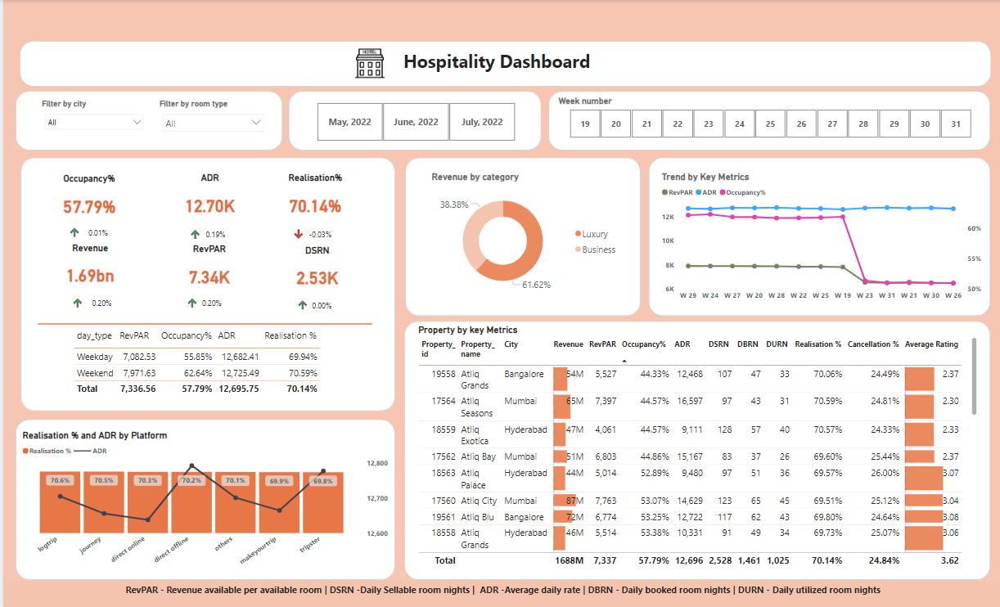

# Revenue Insights in the Hospitality Industry

Welcome to the "Revenue Insights in the Hospitality Industry" project repository! This project showcases a comprehensive data analysis and visualization of key revenue metrics in the hospitality sector using Power BI.

## Project Overview

This project was undertaken to address the unique challenges of the hospitality industry and provide actionable insights to the Revenue team. Through data analytics, we aim to facilitate informed decision-making and optimize revenue management strategies.

### Key Metrics Analyzed

1. **RevPAR (Revenue Per Available Room)**: A critical metric for understanding revenue generation.
2. **ADR (Average Daily Rate)**: Analyzing the average rate paid for rooms sold.
3. **DBRN (Daily Booked Room Nights)**: Tracking daily room bookings.
4. **DSRN (Daily Sellable Room Nights)**: The number of rooms available for sale each day.
5. **DURN (Daily Utilized Room Nights)**: Insights into the number of rooms utilized by customers daily.

## Interactive Dashboard

Explore the interactive dashboard to gain real-time insights into the hospitality industry's revenue metrics. [Interactive Dashboard](https://your-dashboard-link-here)

## Learning Experience

Throughout this project, I've had the opportunity to:

- Understand the specific challenges faced by the hospitality industry.
- Develop my data analytics skills by working with real-world data.
- Create a live, interactive dashboard using Power BI.

## Feedback and Contributions

Your thoughts and feedback are highly appreciated! Feel free to open issues or submit pull requests to enhance this project further. Let's continue this data-driven journey together!

## Repository Details

- **Stars**: 0
- **Watchers**: 1
- **Forks**: 0

## Additional Resources And Credits 

- [Readme](README.md)
- [Codebasics](https://codebasics.io/challenge/codebasics-resume-project-challenge/4)

## Contact

For any queries or further discussion, please reach out through the GitHub repository's issue tracker.

---

© 2024 GitHub, Inc.

### Footer Navigation

- [Terms](https://github.com/site/terms)
- [Privacy](https://github.com/site/privacy)

---

Thank you for visiting the repository! Enjoy exploring the insights and feel free to Share your feedback.

